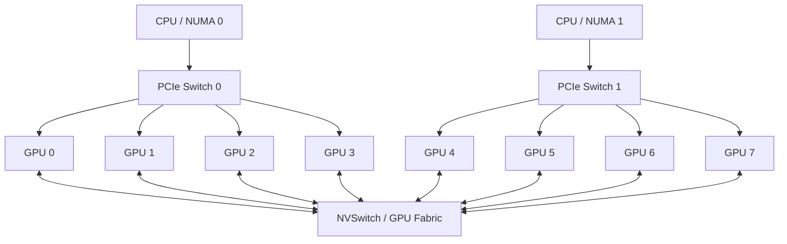

# GPU 互联

!!! info "本章节正在持续完善中 (WIP)"
    当前内容为知识骨架，将继续补充架构细节、选型边界与工程案例。

GPU 互联决定设备间数据交换路径。PCIe、NVLink 与 NVSwitch 的适用范围不同，需要结合通信模式、拓扑和软件栈分析。

```mermaid
flowchart TB
  CPU0[CPU / NUMA 0] --> SW0[PCIe Switch 0]
  CPU1[CPU / NUMA 1] --> SW1[PCIe Switch 1]
  SW0 --> G0[GPU 0]
  SW0 --> G1[GPU 1]
  SW0 --> G2[GPU 2]
  SW0 --> G3[GPU 3]
  SW1 --> G4[GPU 4]
  SW1 --> G5[GPU 5]
  SW1 --> G6[GPU 6]
  SW1 --> G7[GPU 7]
  G0 <--> NV[NVSwitch / GPU Fabric]
  G1 <--> NV
  G2 <--> NV
  G3 <--> NV
  G4 <--> NV
  G5 <--> NV
  G6 <--> NV
  G7 <--> NV
```
