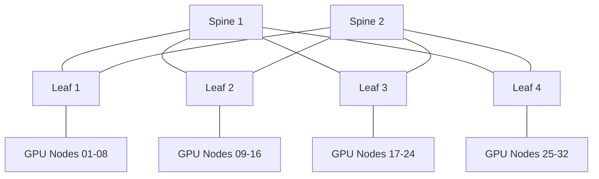

# 集群拓扑

!!! info "本章节正在持续完善中 (WIP)"
    当前内容为知识骨架，将继续补充架构细节、选型边界与工程案例。

拓扑设计需要在带宽收敛、路径冗余、故障域、布线复杂度与成本之间取舍，并与训练或推理通信模式匹配。

```mermaid
flowchart TB
  S1[Spine 1] --- L1[Leaf 1]
  S1 --- L2[Leaf 2]
  S1 --- L3[Leaf 3]
  S1 --- L4[Leaf 4]
  S2[Spine 2] --- L1
  S2 --- L2
  S2 --- L3
  S2 --- L4
  L1 --- N1[GPU Nodes 01-08]
  L2 --- N2[GPU Nodes 09-16]
  L3 --- N3[GPU Nodes 17-24]
  L4 --- N4[GPU Nodes 25-32]
```
